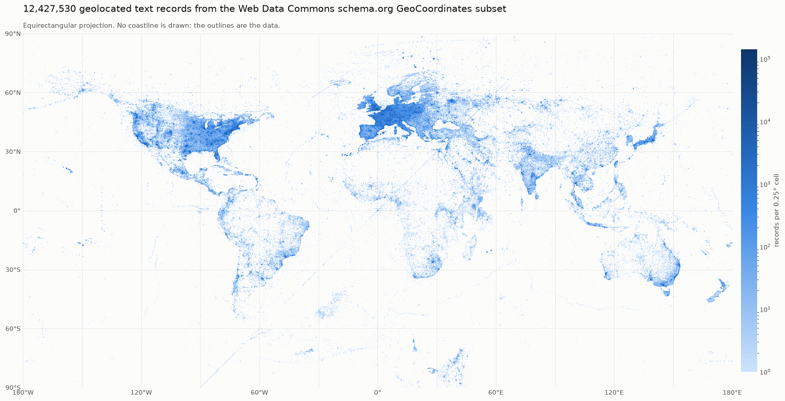

# Overview

What text does the web publish next to coordinates, and is there enough of it to
be useful? This project answers that for the `GeoCoordinates` class-specific
subset of the
[Web Data Commons schema.org series, release 2024-12](https://webdatacommons.org/structureddata/2024-12/stats/schema_org_subsets.html),
and ships the tools that produced the answer.

**The whole subset was read: all 237 parts, 3,183,190,155 lines** — exactly the
quad count Web Data Commons publishes — yielding **51,654,798 geolocated text
records over 12,427,530 distinct places**, with 22,208 lines the parser could
not read (0.0007%).



## What was learned

* **The text is not on the class the subset is named after.** 95.7% of domains
  publish nothing but `latitude` and `longitude` on their `GeoCoordinates`
  entities, and only 3.3% of records are located by a node that also carries
  the text. The rest comes from the parent entity that points at the
  coordinates with `schema:geo`. A pipeline that does not walk that link
  backwards recovers 3% of what is there.
* **Names and addresses are near-universal, prose is not.** 85.9% of records
  carry a name, 82.8% an address, 21.9% a description — 1.09 billion characters
  of names, 2.05 billion of addresses, 3.51 billion of descriptions, each next
  to a coordinate.
* **Redundancy dominates.** 51.7M records are 12.4M distinct places, because
  site-wide markup republishes one business on every page of its site. Raw
  counts overstate the corpus fourfold, and a train/test split made before
  deduplicating is worthless.
* **Coverage is commercial, not geographic.** Populated cells cover 9.5% of the
  world, and the map thins along roads and coastlines rather than by country.
* **89.3% of records carry no language tag**, and the tags that exist are
  spelled inconsistently.
* **The format is clean.** 22,208 unreadable lines in 3.18 billion.

[Findings](findings.md) has the numbers, what they support, and what a 14%
sample of the same corpus got wrong; [the corpus](corpus.md) describes what is
published and how.

## The tools

```bash
uv sync
uv run wdcgeo profile --part 0 --max-lines 2000000   # 15 seconds, no disk used
```

`wdcgeo` streams parts of the subset straight from the mirror, parses the corpus
dialect of N-Quads at about 130,000 lines a second per core, pairs every usable
coordinate pair with the text published next to it on the same page, and either
profiles the result or writes it out as a Hub-ready dataset. See
[using the tools](usage.md), and [design and quality](design.md) for how it is
built and gated.

## The data

<https://huggingface.co/datasets/NoeFlandre/schema-dot-org> — all 12,427,530
deduplicated records, with the merged profile and the map beside them.
